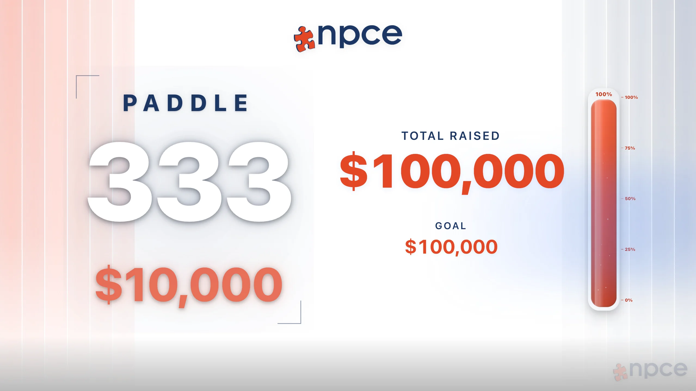
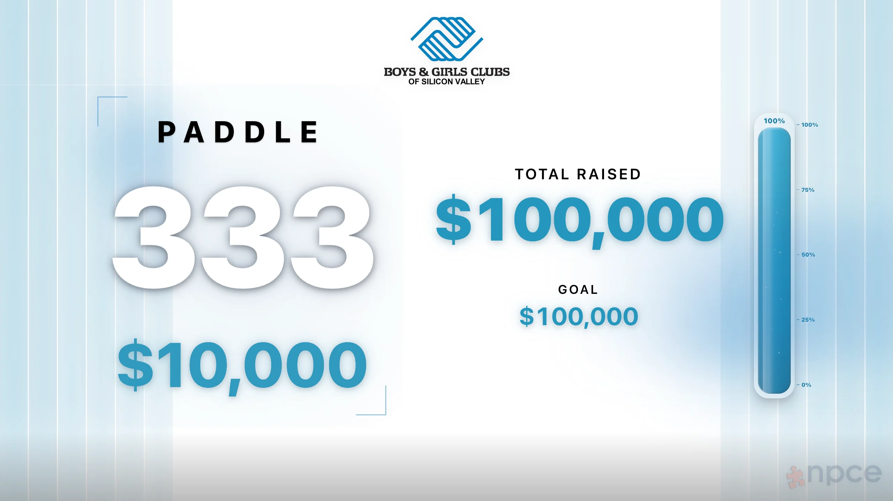
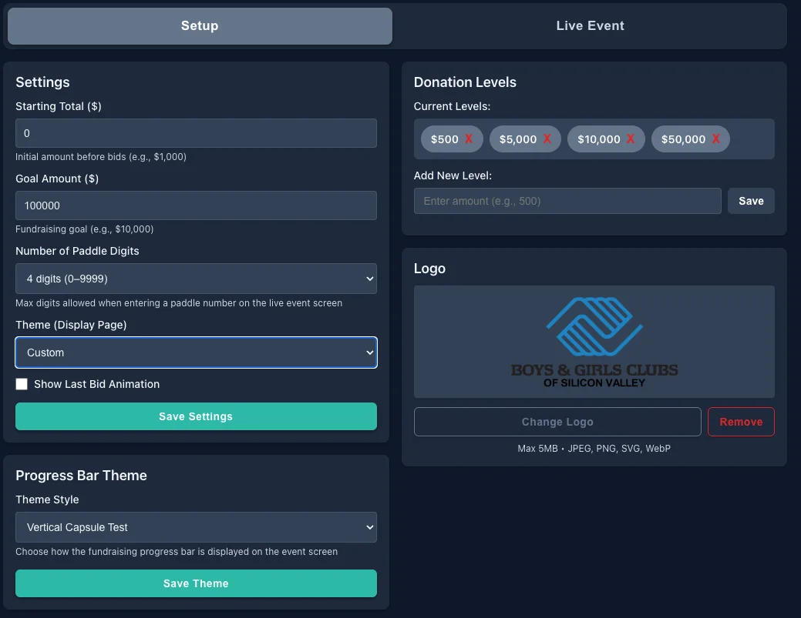
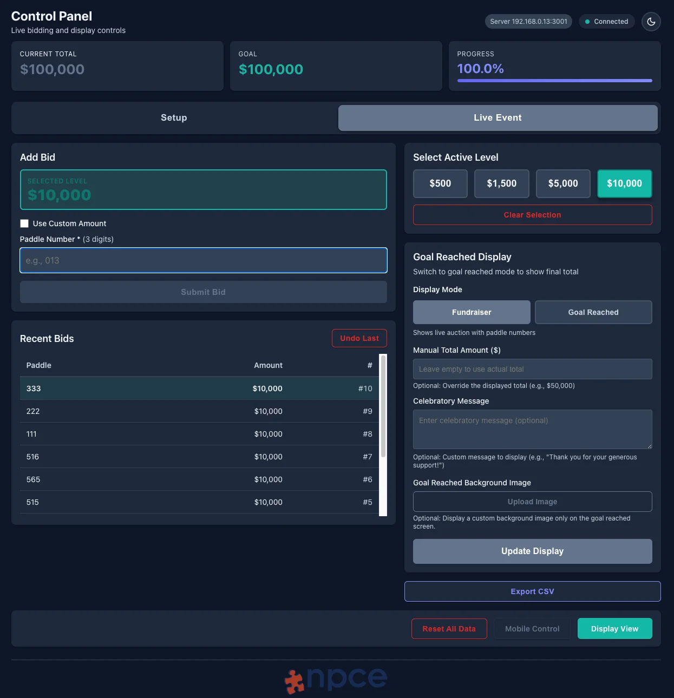

# AuctionTracker

AuctionTracker is a real-time fundraising app for live events. It includes a public display, an operator control panel, and mobile-friendly LAN access.

## Features

- Live fundraising total and progress display
- Operator control panel for bids and settings
- Real-time sync across display, control, and mobile views
- LAN support for on-site device access
- Electron packaging for macOS and Windows

## Tech Stack

- Frontend: React, TypeScript, Vite
- Backend: Node.js, Express, TypeScript
- Database: SQLite (`better-sqlite3`)
- Real-time: Socket.IO
- Desktop: Electron + electron-builder

## Project Structure

```text
AuctionTracker/
  backend/     API, database, websocket server
  frontend/    React app (display/control/mobile)
  electron/    Electron main + preload scripts
  release/     Packaging output (generated)
```

## Preview

<video src="./GithubPhotos/animation.mp4" controls muted loop playsinline></video>






## Setup

```bash
git clone <your-repo-url>
cd AuctionTracker
npm install
npm --prefix backend install
npm --prefix frontend install
```

## Run in Development

```bash
npm run dev
```

- Frontend: `http://localhost:5173`
- Backend API: `http://localhost:3001`

## Build and Package

```bash
npm run build:electron  # Build backend + frontend for Electron
npm run dist:dir        # Unpacked app directory
npm run dist:mac:zip    # macOS ZIP
npm run dist:mac        # macOS DMG + ZIP
npm run dist:win        # Windows NSIS installer (.exe)
npm run dist:win:zip    # Windows ZIP
```

Packaging output is written to `release/`.

## Packaged App Behavior

- Backend starts inside Electron
- Server binds to `0.0.0.0` for LAN access
- First available port is used from: `5000`, `5001`, `5002`
- Electron opens display (`/`) and control (`/control`) windows automatically

## LAN Access

From another device on the same network:

- Control: `http://<LAN_IP>:<PORT>/control`
- Mobile: `http://<LAN_IP>:<PORT>/mobile`

## License

MIT
